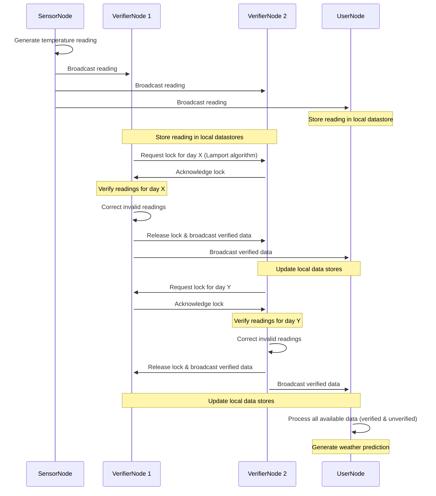
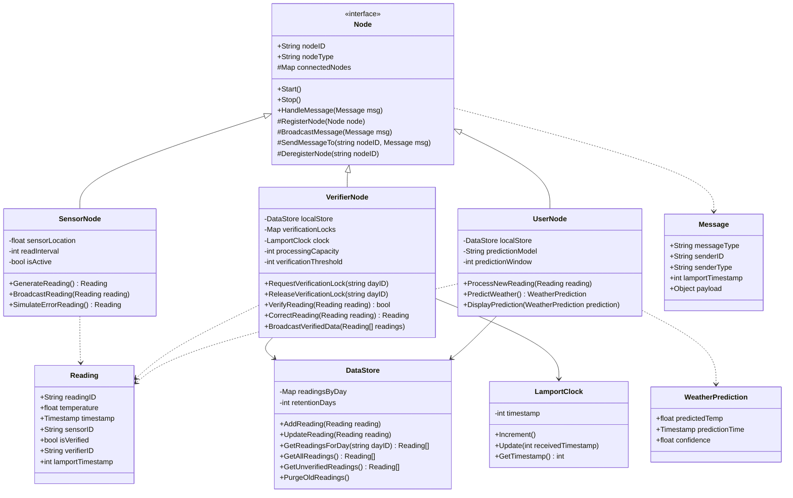
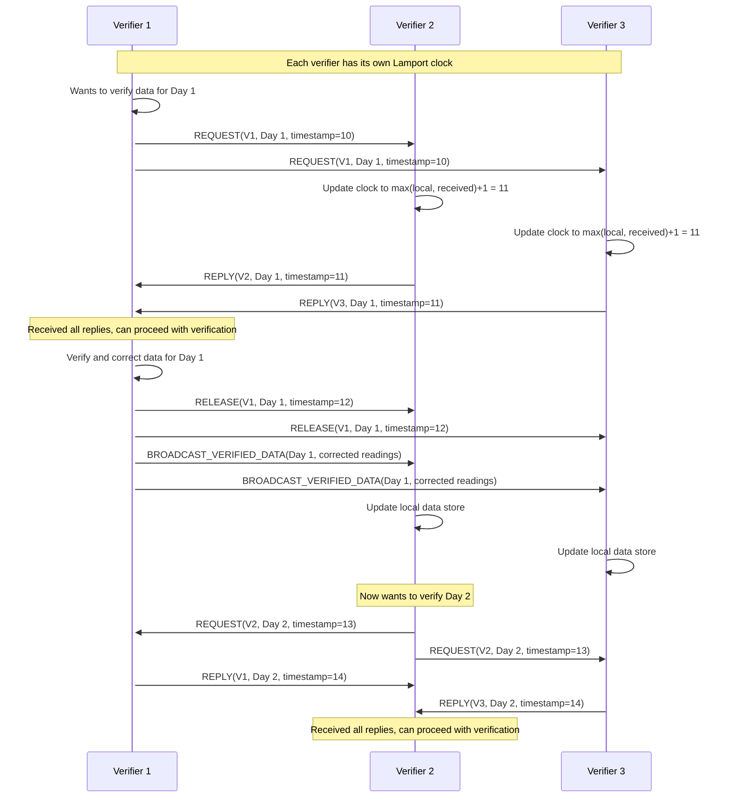

# Distributed Data Sharing System (applied to Temperature) 🌦️ $\to$ ⚙️ $\to$ 📈

## Project Description 🗃️

This project implements a **fully decentralized distributed system** where multiple types of nodes collaborate to collect, verify, and use data across different sites.  

The system models a real-world scenario where devices collect sensor data, verify its accuracy, and produce predictions, while ensuring correct coordination and consistency across geographically separate nodes.

For educational purpose, it is applied to temperature data: sensors get temperature, and users predict the next day weather based on the 15 days past data. 
All system's nodes will work on their own copy o fthis dataset (the 15 past data, *15 past days as working with temperature*).

The core idea is that **sensors might give erroneous data, perturbating the users**. Thus, verifier systems are integrated to update, slowly, each data point one after the other.
The goal is to observe the impact of verifier parameters on user behaviors.

Each node maintains a **local replica** of the shared dataset (past 15 days of temperature readings) and participates in maintaining **consistency** between replicas using a **distributed mutual exclusion algorithm** based on **Lamport timestamps**.

---

## Node Types 📑

- **Sensor Nodes**  
  Periodically generate new temperature readings.  
  Insert new data into the local replica, ensuring mutual exclusion using Lamport's distributed queue before updating peers.

- **Verifier Nodes**  
  Continuously check past temperature readings for anomalies.  
  Correct invalid data by locking the critical section, applying the fix, and propagating the update across all nodes.

- **User Nodes**  
  Use the available (verified or unverified) local data to perform predictions, such as forecasting tomorrow’s temperature trends.

---

## Key Features 💡

- **Decentralized Architecture**:  
  No centralized database. All nodes maintain and update their own local replica.

- **Replica Consistency**:  
  Nodes coordinate using a **distributed queue with logical clocks** to serialize all updates.

- **Shared Data Management**:  
  Nodes work on a **sliding window** of the latest 15 days of temperature readings.

- **P2P Communication**:  
  Direct messaging between nodes for update propagation and coordination.

- **Flexible Role Execution**:  
  A single program can run in different node modes (`sensor`, `verifier`, or `user`) based on configuration at launch.

---

## Technical Highlights 🔬

- **Lamport Clock Synchronization** for ordering and mutual exclusion.
- **Distributed Queue** to manage critical-section access for updates.
- **Efficient Broadcast** of updates to maintain replica synchronization.
- **Fault-Tolerant Design** ready for simple peer-failure recovery (future work).

---

## Scenario Example 🎉

1. **Sensor** generates a new reading (e.g., 25°C on April 25th).
2. It requests critical section access using its Lamport timestamp.
3. Once access is granted, it inserts the new data and multicasts the update.
4. **Verifiers** independently scan local replicas, detect anomalies (e.g., an impossible 200°C reading), and correct them through the same distributed locking mechanism.
5. **Users** read all local data to predict the temperature for April 26th without needing to lock.

## Data Flow 🌊

Below is a flowchart representing the broadcasting of a sensor data, then verification of this data with request & release.
From reading the chart, it can be seen that *only the verifier nodes and sensors* need to send data, thus need to request & release data.
Users only receive and update their local data replica.

## Class Diagram 🔬

Below is a proposition of class diagram.

- Senrors, Verifiers, Users are all Nodes, thus share a basic structure (Node class), 
  and has their own DataStore.
- Sensors produce Readings
- Users produce WeatherPrediction
- Nodes shares Message
- clocks are represented via LamportClock (as the Lamport algorithm might be used)

*Protected elements of Nodes (ie with #) are elements that might be used to help process and send the messages.
They might be changed to a dedicated control layer.*

## Synchronisation algorithm (Lamport) 🔬

Below if a sequence diagram of the synchronisation algorithme where Verifiers request, check, update and release data.
They only have to request data exclusivity to other Verifiers (ie not Sensors nor Users), as only Verifiers updates data.

