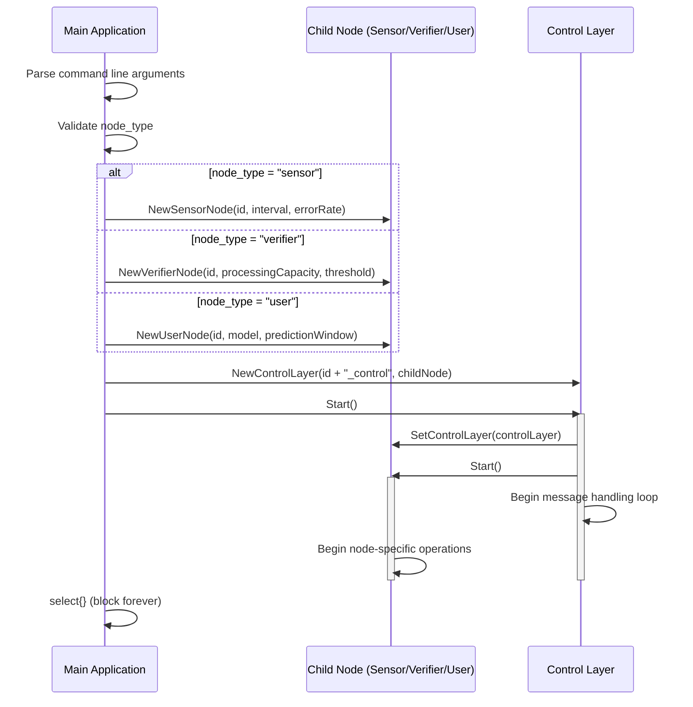
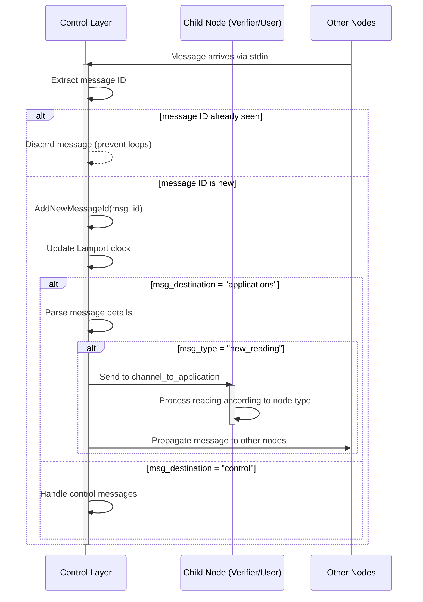
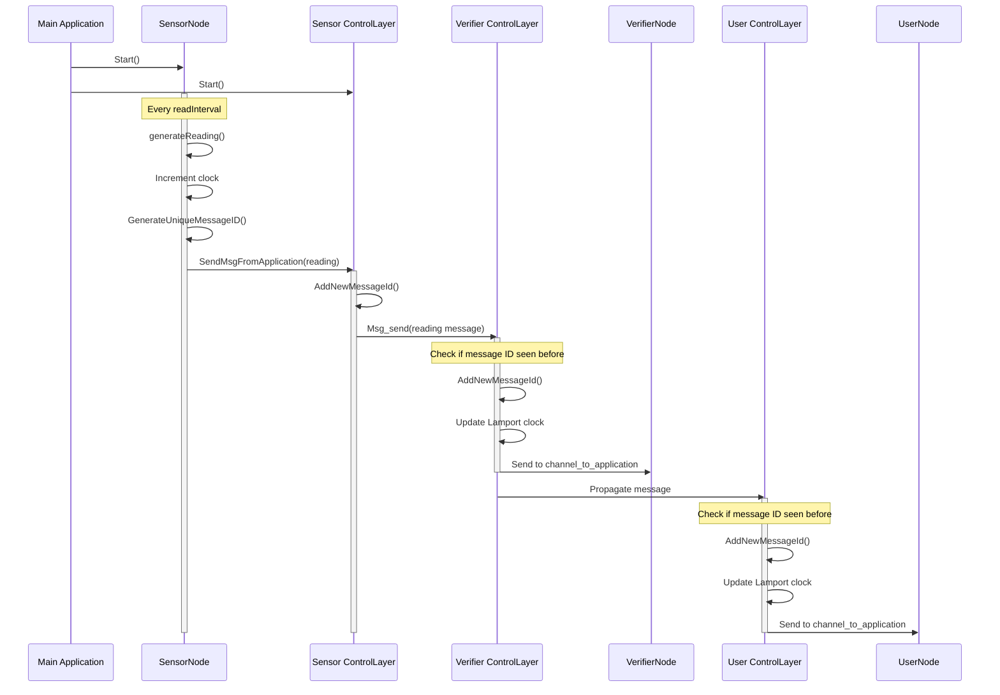
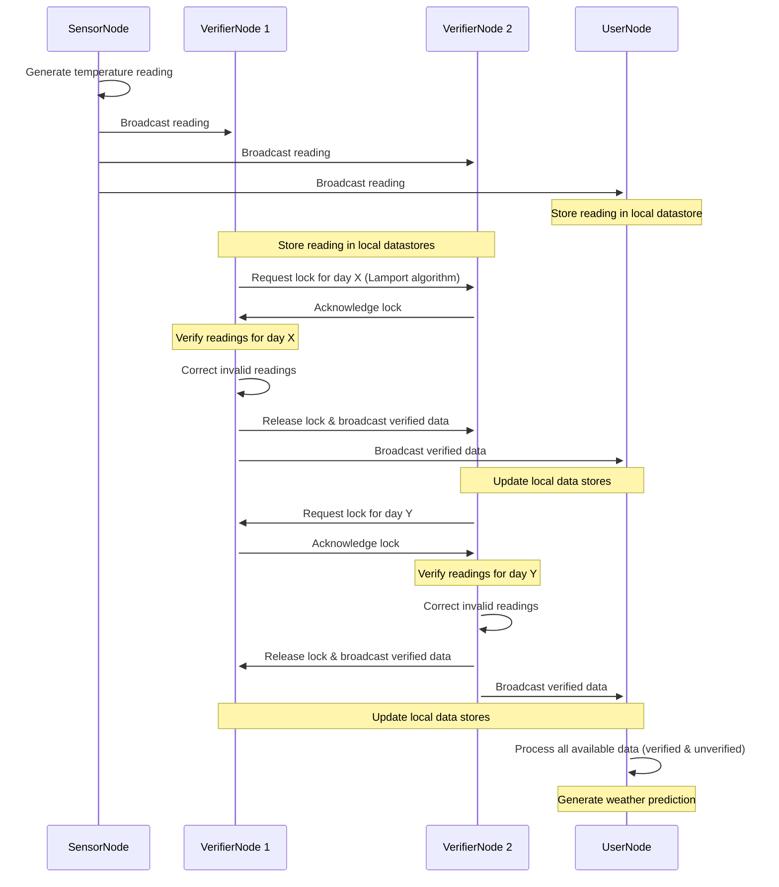
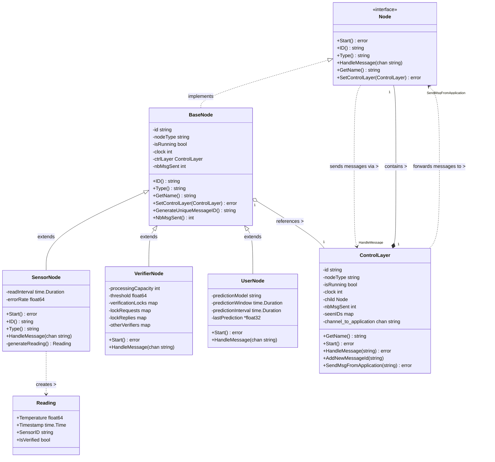
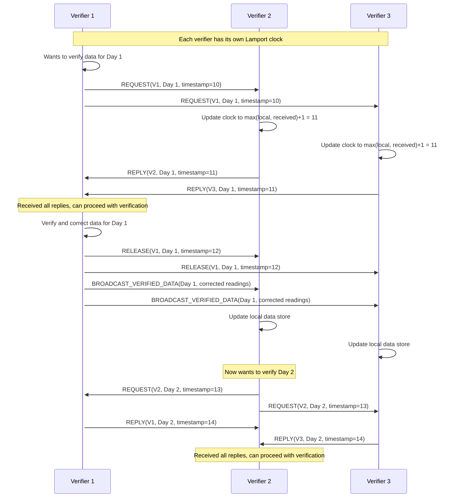

# Distributed Data Sharing System (applied to Temperature) 🌦️ $\to$ ⚙️ $\to$ 📈

## Project Description 🗃️

This project implements a **fully decentralized distributed system** where multiple types of nodes collaborate to collect, verify, and use data across different sites.  

The system models a real-world scenario where devices collect sensor data, verify its accuracy, and produce predictions, while ensuring correct coordination and consistency across geographically separate nodes.

For educational purpose, it is applied to temperature data: sensors get temperature, and users predict the next day weather based on the 15 days past data. 
All system's nodes will work on their own copy o fthis dataset (the 15 past data, *15 past days as working with temperature*).

The core idea is that **sensors might give erroneous data, perturbating the users**. Thus, verifier systems are integrated to update, slowly, each data point one after the other.
The goal is to observe the impact of verifier parameters on user behaviors.

Each node maintains a **local replica** of the shared dataset (past 15 days of temperature readings) and participates in maintaining **consistency** between replicas using a **distributed mutual exclusion algorithm** based on **Lamport timestamps**.


---

## Usage 🔌

Build: 
```bash
go build main.go
```

Then, to create a connection between a Sensor (which send a message every two seconds) and 
a Verifier (which prints the received message): 

```bash
./main -node_type sensor | ./main -node_type verifier
```

which produces:
```bash
 + [Verifier_1 163913] main     : Verifier_1 received </=sender_name=Sensor 1/=clk=1>
 + [Verifier_1 163913] main     : Verifier_1 received </=sender_name=Sensor 1/=clk=2>
 + [Verifier_1 163913] main     : Verifier_1 received </=sender_name=Sensor 1/=clk=3>
```

The `main` program takes the arguments:

| Argument     | Meaning                                                |
|--------------|--------------------------------------------------------|
| `-node_type` | Type of node: sensor, verifier, user (default: sensor) |
| `-node_name` | Name of the node (default: "Sensor 1")                 |

To create a unidirectional ring network, use the `network_ring_unidirectional.sh` script.

For a bidirectional ring network,use the `network_ring.sh`.

Below is a **bi**directional ring network (`network_ring.sh`):


### Examples

### First example with a bidirectional ring 

Two nodes are present: a sensor and a verifier. Below is a full execution (stopped after a few seconds), which will then be explained:

```bash
❯ ./network_ring.sh \
  A:-node_type,sensor \
  B:-node_type,verifier


✅ Launched 2 nodes: A B
   (hit Ctrl+C to stop & clean up)


 + [control_laye 30034] Start()  : Starting control layer  (1_control)

 + [node_verifie 30034] Start()  : Starting verifier node verifier (1)

 + [control_laye 30032] Start()  : Starting control layer  (0_control)

 + [node_sensor. 30032] Start()  : Starting sensor node 0

 * [ (0_control) 30032] msg_send : émission de /=destination=applications/=clk=1/=content_type=sensor_reading/=content_value=20.137077/=id=sensor_0_0/=type=new_reading/=sender_name=sensor (0)/=sender_type=sensor

/=destination=applications/=clk=1/=content_type=sensor_reading/=content_value=20.137077/=id=sensor_0_0/=type=new_reading/=sender_name=sensor (0)/=sender_type=sensor
 + [HandleMessag 30034]  (1_cont :  (1_control) received the new reading <20.137077>

 * [ (1_control) 30034] msg_send : émission de /=destination=applications/=clk=1/=content_type=sensor_reading/=content_value=20.137077/=id=sensor_0_0/=type=new_reading/=sender_name=sensor (0)/=sender_type=sensor

/=destination=applications/=clk=1/=content_type=sensor_reading/=content_value=20.137077/=id=sensor_0_0/=type=new_reading/=sender_name=sensor (0)/=sender_type=sensor
 + [HandleMessag 30034] verifier : verifier (1) received the new reading <20.137077>

 * [ (0_control) 30032] msg_send : émission de /=clk=2/=content_type=sensor_reading/=content_value=-78.124306/=id=sensor_0_1/=type=new_reading/=sender_name=sensor (0)/=sender_type=sensor/=destination=applications

/=clk=2/=content_type=sensor_reading/=content_value=-78.124306/=id=sensor_0_1/=type=new_reading/=sender_name=sensor (0)/=sender_type=sensor/=destination=applications
 + [HandleMessag 30034] verifier : verifier (1) received the new reading <-78.124306>

 + [HandleMessag 30034]  (1_cont :  (1_control) received the new reading <-78.124306>

 * [ (1_control) 30034] msg_send : émission de /=clk=2/=content_type=sensor_reading/=content_value=-78.124306/=id=sensor_0_1/=type=new_reading/=sender_name=sensor (0)/=sender_type=sensor/=destination=applications

/=clk=2/=content_type=sensor_reading/=content_value=-78.124306/=id=sensor_0_1/=type=new_reading/=sender_name=sensor (0)/=sender_type=sensor/=destination=applications
 * [ (0_control) 30032] msg_send : émission de /=destination=applications/=clk=3/=content_type=sensor_reading/=content_value=20.628366/=id=sensor_0_2/=type=new_reading/=sender_name=sensor (0)/=sender_type=sensor

/=destination=applications/=clk=3/=content_type=sensor_reading/=content_value=20.628366/=id=sensor_0_2/=type=new_reading/=sender_name=sensor (0)/=sender_type=sensor
 + [HandleMessag 30034]  (1_cont :  (1_control) received the new reading <20.628366>

 * [ (1_control) 30034] msg_send : émission de /=destination=applications/=clk=3/=content_type=sensor_reading/=content_value=20.628366/=id=sensor_0_2/=type=new_reading/=sender_name=sensor (0)/=sender_type=sensor

/=destination=applications/=clk=3/=content_type=sensor_reading/=content_value=20.628366/=id=sensor_0_2/=type=new_reading/=sender_name=sensor (0)/=sender_type=sensor
 + [HandleMessag 30034] verifier : verifier (1) received the new reading <20.628366>

 * [ (0_control) 30032] msg_send : émission de /=content_value=-56.102753/=id=sensor_0_3/=type=new_reading/=sender_name=sensor (0)/=sender_type=sensor/=destination=applications/=clk=4/=content_type=sensor_reading

/=content_value=-56.102753/=id=sensor_0_3/=type=new_reading/=sender_name=sensor (0)/=sender_type=sensor/=destination=applications/=clk=4/=content_type=sensor_reading
 + [HandleMessag 30034]  (1_cont :  (1_control) received the new reading <-56.102753>

 * [ (1_control) 30034] msg_send : émission de /=content_value=-56.102753/=id=sensor_0_3/=type=new_reading/=sender_name=sensor (0)/=sender_type=sensor/=destination=applications/=clk=4/=content_type=sensor_reading

 + [HandleMessag 30034] verifier : verifier (1) received the new reading <-56.102753>
```

Let's analyze this.

First, each control layer is activated, and starts the associated application layer (sensor and verifier):

```
 + [control_laye 30034] Start()  : Starting control layer  (1_control)
 + [node_verifie 30034] Start()  : Starting verifier node verifier (1)
 + [control_laye 30032] Start()  : Starting control layer  (0_control)
 + [node_sensor. 30032] Start()  : Starting sensor node 0
```

Then, the sensor reads a temperature and asks to its control layer to send the message (the temperature) to all nodes. What is written is the control layer warning that it will send a message, and then the message:

```
 * [ (0_control) 30032] msg_send : émission de /=destination=applications/=clk=1/=content_type=sensor_reading/=content_value=20.137077/=id=sensor_0_0/=type=new_reading/=sender_name=sensor (0)/=sender_type=sensor

/=destination=applications/=clk=1/=content_type=sensor_reading/=content_value=20.137077/=id=sensor_0_0/=type=new_reading/=sender_name=sensor (0)/=sender_type=sensor
```

As the message is sent, the control layer of the second node (the verifier's control layer) receives this message :

```
 + [HandleMessag 30034]  (1_cont :  (1_control) received the new reading <20.137077>

```

and as this control layer never saw this message before, it then re-emit this message to others : (*even if here, it has no other neighbor*)

```
 * [ (1_control) 30034] msg_send : émission de /=destination=applications/=clk=1/=content_type=sensor_reading/=content_value=20.137077/=id=sensor_0_0/=type=new_reading/=sender_name=sensor (0)/=sender_type=sensor
```

The sensor's control layer doesn't process this re-emitted message, at it has saved the sent message's id, so it knows it already processed this message.

The verifier's control layer also gave the message to its application layer,  the verifier :

```
 + [HandleMessag 30034] verifier : verifier (1) received the new reading <20.137077>
```

Which complete the cycle! Then, the sensor's control layer receives a new message from its application level, thus emits the new temperature (new message from `sender_name = sensor (0)` with a clock of 2). And the cycle continues.

### Example by sequence diagrams

#### Operations flow at system startup



#### Message handling inner flow

A message arrives at the control layer, which needs to check the destination (is it for a control operation, or for the application layer) :



#### Message handling outer flow

Message flow between controllers and nodes. An example with one node of each type :



---

## Key Features 💡

- **Decentralized Architecture**:  
  No centralized database. All nodes maintain and update their own local replica.

- **Replica Consistency**:  
  Nodes coordinate using a **distributed queue with logical clocks** to serialize all updates.

- **Shared Data Management**:  
  Nodes work on a **sliding window** of the latest 15 days of temperature readings.

- **P2P Communication**:  
  Direct messaging between nodes for update propagation and coordination.

- **Flexible Role Execution**:  
  A single program can run in different node modes (`sensor`, `verifier`, or `user`) based on configuration at launch.

---

## Technical Highlights 🔬

- **Lamport Clock Synchronization** for ordering and mutual exclusion.
- **Distributed Queue** to manage critical-section access for updates.
- **Efficient Broadcast** of updates to maintain replica synchronization.
- **Fault-Tolerant Design** ready for simple peer-failure recovery (future work).

---

## Scenario Example 🎉

1. **Sensor** generates a new reading (e.g., 25°C on April 25th).
2. It requests critical section access using its Lamport timestamp.
3. Once access is granted, it inserts the new data and multicasts the update.
4. **Verifiers** independently scan local replicas, detect anomalies (e.g., an impossible 200°C reading), and correct them through the same distributed locking mechanism.
5. **Users** read all local data to predict the temperature for April 26th without needing to lock.

---

## Data Flow 🌊 (abstract level)

Below is a flowchart representing the broadcasting of a sensor data, then verification of this data with request & release.
From reading the chart, it can be seen that *only the verifier nodes and sensors* need to send data, thus need to request & release data.
Users only receive and update their local data replica.



## Class Diagram 🔬

Below is a proposition of class diagram.

- Senrors, Verifiers, Users are all Nodes, thus share a basic structure (Node class), 
  and has their own DataStore.
- Sensors produce Readings
- Users produce WeatherPrediction
- Nodes shares Message
- clocks are represented via LamportClock (as the Lamport algorithm might be used)

*Protected elements of Nodes (ie with #) are elements that might be used to help process and send the messages.
They might be changed to a dedicated control layer.*




## Synchronisation algorithm (Lamport) 🔬

Below if a sequence diagram of the synchronisation algorithme where Verifiers request, check, update and release data.
They only have to request data exclusivity to other Verifiers (ie not Sensors nor Users), as only Verifiers updates data.



