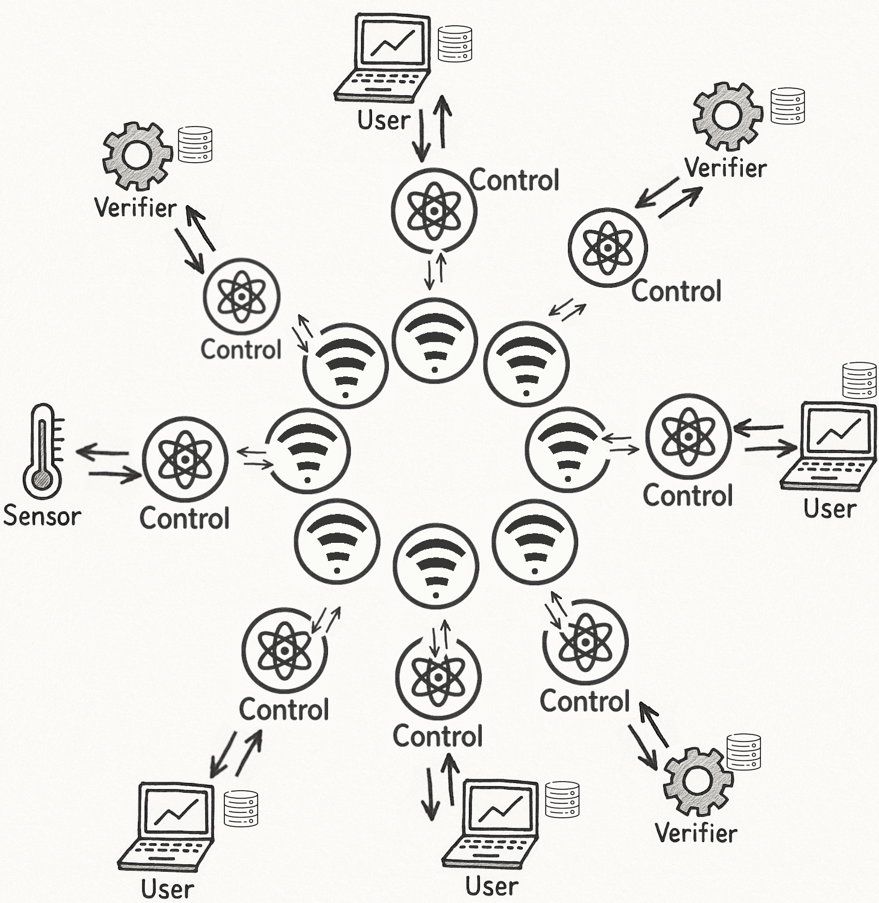

# Distributed Data Sharing System (applied to Temperature) 🌦️ $\to$ ⚙️ $\to$ 📈

## Project Description 🗃️

This project implements a **fully decentralized distributed system** where multiple types of nodes collaborate to collect, verify, and use data across different sites.  

The system models a real-world scenario where devices collect sensor data, verify its accuracy, and produce predictions, while ensuring correct coordination and consistency across geographically separate nodes.

For educational purpose, it is applied to temperature data: sensors get temperature, and users predict the next day weather based on the 15 days past data. 
All system's nodes will work on their own copy of this dataset (the 15 past data, *15 past days as working with temperature*).

The core idea is that **sensors might give erroneous data, perturbating the users**. Thus, verifier systems are integrated to update, slowly, each data point one after the other.
The goal is to observe the impact of verifier parameters on user behaviors.

Each node maintains a **local replica** of the shared dataset (past 15 days of temperature readings) and participates in maintaining **consistency** between replicas using **locks** and **logical clocks**.


---

## Usage 🔌

Build: 
```bash
go build main.go
```

Then, to create a connection between a Sensor (which send a message every two seconds) and 
a Verifier (which prints the received message): 

```bash
./main -node_type sensor | ./main -node_type verifier
```

which produces:
```bash
 + [Verifier_1 163913] main     : Verifier_1 received </=sender_name=Sensor 1/=clk=1>
 + [Verifier_1 163913] main     : Verifier_1 received </=sender_name=Sensor 1/=clk=2>
 + [Verifier_1 163913] main     : Verifier_1 received </=sender_name=Sensor 1/=clk=3>
```

The `main` program takes the arguments:

| Argument     | Meaning                                                                 |
|--------------|-------------------------------------------------------------------------|
| `-node_type` | Type of node: sensor, verifier, user_linear, user_exp (default: sensor) |
| `-node_name` | Name of the node (default: "Sensor 1")                                  |

To create a unidirectional ring network, use the `network_ring_unidirectional.sh` script.

For a bidirectional ring network,use the `network_ring.sh`.

Below is a **bi**directional ring network (`network_ring.sh`):




## Key Features 💡

- **Decentralized Architecture**:  
  No centralized database. All nodes maintain and update their own local replica.

- **Replica Consistency**:  
  Nodes coordinate using a **distributed queue with logical clocks** to serialize all updates.

- **Shared Data Management**:  
  Nodes work on a **sliding window** of the latest 15 days of temperature readings.

- **P2P Communication**:  
  Direct messaging between nodes for update propagation and coordination.

- **Flexible Role Execution**:  
  A single program can run in different node modes (`sensor`, `verifier`, or `user`) based on configuration at launch.


### Pear Discovery

Pear discovery works as so:

- The node whose id is `0_control` (the first control node), no matter the application it is related to, will be the initiator and will send a `pear_discovery` message to all other control nodes (*after a wait of 1 second, to make sure all nodes did start*)
- all control nodes will answer to `0_control` (directly, and only) with their own names
- after another wait of 1 second, the initiator will accept all received names as definitive, as close the pear discovery. It will thus propagate all received node names to all nodes, so that every control layers know who is in the network (and thus how many).
- The initiator will then start its application layer.
- The other nodes, on startup, wait for 2 seconds (equivalent to initiator's 2 one second waits) before starting their application layer.

---

## Scenario Example 🎉

1. **Sensor** generates a new reading (e.g., 25°C).
2. It broadcasts the reading to all nodes, including verifiers and users, which will store it in their local data stores.
3. **Verifiers** receive the reading and ask for a lock to verify the data. They send a request to all other verifiers.
4. Once all verifiers grant access, the requesting verifier processes the data (e.g., checks for anomalies) and updates the local data store.
5. It then releases the lock and sends the verified data to all nodes, including users.
6. **Users** receive the verified data and update their local data stores.
7. **Users** read all local data to predict the temperature, without needing to lock.

---


### Examples

### First example with a bidirectional ring 

Two nodes are present: a sensor and a verifier. Below is a full execution (stopped after a few seconds), which will then be explained:

```bash
❯ ./network_ring.sh \
  A:-node_type,sensor \
  B:-node_type,verifier


✅ Launched 2 nodes: A B
   (hit Ctrl+C to stop & clean up)


 + [control_laye 30034] Start()  : Starting control layer  (1_control)

 + [node_verifie 30034] Start()  : Starting verifier node verifier (1)

 + [control_laye 30032] Start()  : Starting control layer  (0_control)

 + [node_sensor. 30032] Start()  : Starting sensor node 0

 * [ (0_control) 30032] msg_send : émission de /=destination=applications/=clk=1/=content_type=sensor_reading/=content_value=20.137077/=id=sensor_0_0/=type=new_reading/=sender_name=sensor (0)/=sender_type=sensor

/=destination=applications/=clk=1/=content_type=sensor_reading/=content_value=20.137077/=id=sensor_0_0/=type=new_reading/=sender_name=sensor (0)/=sender_type=sensor
 + [HandleMessag 30034]  (1_cont :  (1_control) received the new reading <20.137077>

 * [ (1_control) 30034] msg_send : émission de /=destination=applications/=clk=1/=content_type=sensor_reading/=content_value=20.137077/=id=sensor_0_0/=type=new_reading/=sender_name=sensor (0)/=sender_type=sensor

/=destination=applications/=clk=1/=content_type=sensor_reading/=content_value=20.137077/=id=sensor_0_0/=type=new_reading/=sender_name=sensor (0)/=sender_type=sensor
 + [HandleMessag 30034] verifier : verifier (1) received the new reading <20.137077>

 * [ (0_control) 30032] msg_send : émission de /=clk=2/=content_type=sensor_reading/=content_value=-78.124306/=id=sensor_0_1/=type=new_reading/=sender_name=sensor (0)/=sender_type=sensor/=destination=applications

/=clk=2/=content_type=sensor_reading/=content_value=-78.124306/=id=sensor_0_1/=type=new_reading/=sender_name=sensor (0)/=sender_type=sensor/=destination=applications
 + [HandleMessag 30034] verifier : verifier (1) received the new reading <-78.124306>

 + [HandleMessag 30034]  (1_cont :  (1_control) received the new reading <-78.124306>

 * [ (1_control) 30034] msg_send : émission de /=clk=2/=content_type=sensor_reading/=content_value=-78.124306/=id=sensor_0_1/=type=new_reading/=sender_name=sensor (0)/=sender_type=sensor/=destination=applications

/=clk=2/=content_type=sensor_reading/=content_value=-78.124306/=id=sensor_0_1/=type=new_reading/=sender_name=sensor (0)/=sender_type=sensor/=destination=applications
 * [ (0_control) 30032] msg_send : émission de /=destination=applications/=clk=3/=content_type=sensor_reading/=content_value=20.628366/=id=sensor_0_2/=type=new_reading/=sender_name=sensor (0)/=sender_type=sensor

/=destination=applications/=clk=3/=content_type=sensor_reading/=content_value=20.628366/=id=sensor_0_2/=type=new_reading/=sender_name=sensor (0)/=sender_type=sensor
 + [HandleMessag 30034]  (1_cont :  (1_control) received the new reading <20.628366>

 * [ (1_control) 30034] msg_send : émission de /=destination=applications/=clk=3/=content_type=sensor_reading/=content_value=20.628366/=id=sensor_0_2/=type=new_reading/=sender_name=sensor (0)/=sender_type=sensor

/=destination=applications/=clk=3/=content_type=sensor_reading/=content_value=20.628366/=id=sensor_0_2/=type=new_reading/=sender_name=sensor (0)/=sender_type=sensor
 + [HandleMessag 30034] verifier : verifier (1) received the new reading <20.628366>

 * [ (0_control) 30032] msg_send : émission de /=content_value=-56.102753/=id=sensor_0_3/=type=new_reading/=sender_name=sensor (0)/=sender_type=sensor/=destination=applications/=clk=4/=content_type=sensor_reading

/=content_value=-56.102753/=id=sensor_0_3/=type=new_reading/=sender_name=sensor (0)/=sender_type=sensor/=destination=applications/=clk=4/=content_type=sensor_reading
 + [HandleMessag 30034]  (1_cont :  (1_control) received the new reading <-56.102753>

 * [ (1_control) 30034] msg_send : émission de /=content_value=-56.102753/=id=sensor_0_3/=type=new_reading/=sender_name=sensor (0)/=sender_type=sensor/=destination=applications/=clk=4/=content_type=sensor_reading

 + [HandleMessag 30034] verifier : verifier (1) received the new reading <-56.102753>
```

Let's analyze this.

First, each control layer is activated, and starts the associated application layer (sensor and verifier):

```
 + [control_laye 30034] Start()  : Starting control layer  (1_control)
 + [node_verifie 30034] Start()  : Starting verifier node verifier (1)
 + [control_laye 30032] Start()  : Starting control layer  (0_control)
 + [node_sensor. 30032] Start()  : Starting sensor node 0
```

Then, the sensor reads a temperature and asks to its control layer to send the message (the temperature) to all nodes. What is written is the control layer warning that it will send a message, and then the message:

```
 * [ (0_control) 30032] msg_send : émission de /=destination=applications/=clk=1/=content_type=sensor_reading/=content_value=20.137077/=id=sensor_0_0/=type=new_reading/=sender_name=sensor (0)/=sender_type=sensor

/=destination=applications/=clk=1/=content_type=sensor_reading/=content_value=20.137077/=id=sensor_0_0/=type=new_reading/=sender_name=sensor (0)/=sender_type=sensor
```

As the message is sent, the control layer of the second node (the verifier's control layer) receives this message :

```
 + [HandleMessag 30034]  (1_cont :  (1_control) received the new reading <20.137077>

```

and as this control layer never saw this message before, it then re-emit this message to others : (*even if here, it has no other neighbor*)

```
 * [ (1_control) 30034] msg_send : émission de /=destination=applications/=clk=1/=content_type=sensor_reading/=content_value=20.137077/=id=sensor_0_0/=type=new_reading/=sender_name=sensor (0)/=sender_type=sensor
```

The sensor's control layer doesn't process this re-emitted message, at it has saved the sent message's id, so it knows it already processed this message.

The verifier's control layer also gave the message to its application layer,  the verifier :

```
 + [HandleMessag 30034] verifier : verifier (1) received the new reading <20.137077>
```

Which complete the cycle! Then, the sensor's control layer receives a new message from its application level, thus emits the new temperature (new message from `sender_name = sensor (0)` with a clock of 2). And the cycle continues.

### Example by sequence diagrams

#### Operations flow at system startup

<details open>
  <summary>System startup diagram</summary>


	
</details>

#### Message handling inner flow

<details open>
  <summary>A message arrives at the control layer, which needs to check the destination (is it for a control operation, or for the application layer)</summary>


	
</details>

#### Message handling outer flow


<details open>
  <summary>Message flow between controllers and nodes. An example with one node of each type</summary>


	
</details>

---


## Data Flow 🌊

Below is a flowchart representing the broadcasting of a sensor data, then verification of this data with request & release.
From reading the chart, it can be seen that:

- only verifier nodes and sensors need to send data
- only verifier nodes need to request & release data, and only between them.
- users only receive and update their local data replica.

<details open>
  <summary>Diagram</summary>
	


</details>

## Class Diagram 🔬

Below is a proposition of class diagram.

- Senrors, Verifiers, Users are all Nodes, thus share a basic structure (Node class), 
  and has their own DataStore.
- Sensors produce Readings
- clocks are represented via integers.


<details open>
  <summary>Class Diagram</summary>
	


</details>
